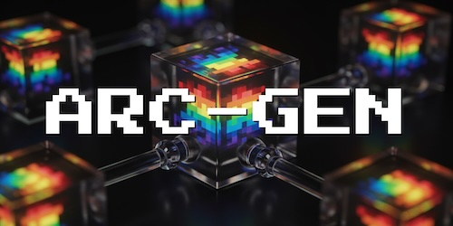

<p align="center">

</p>

This repository contains the source code for *ARC-GEN: A Mimetic Procedural Benchmark Generator for the Abstraction and Reasoning Corpus*.

## Installation

```
$ git clone --recurse-submodules https://github.com/google/ARC-GEN.git && cd ARC-GEN
```

## Usage

For **benchmark generation**, use the `generate` command with two arguments: the task number, and the desired number of example pairs.

```
$ python3 arc_gen.py generate 32 1000
[{'input': [[4, 0, 0, 0], [0, 0, 0, 0], [4, 0, 8, 0], [0, 3, 8, 0]], 'output': ...
```

For **validation** (i.e., to ensure that the ARC-GEN generators can collectively reproduce the original [ARC-AGI-1](https://github.com/fchollet/ARC-AGI) benchmark suite), use the `validate` command:

```
$ python3 arc_gen.py validate
A total of 400 generators passed.
A total of 0 generators failed.
```

For an example of customized **variations**, refer to [arc_gen_variations.py](https://github.com/google/ARC-GEN/blob/main/arc_gen_variations.py), which produces two variations on [Task #125](https://arcprize.org/play?task=543a7ed5):

```
  _, generator, _ = task_list.task_list().get(125)
  examples = []
  # Two examples of a "large" variation on Task #125.
  examples.extend([generator(boxes=8, size=28) for _ in range(2)])
  # Two examples of a "large + inverted" variation on Task #125.
  common.set_colors([0, 1, 2, 6, 8, 5, 3, 7, 4, 9])
  examples.extend([generator(boxes=8, size=28) for _ in range(2)])
```

## The ARC-GEN-100K Dataset

For those seeking a pre-generated dataset of sample pairs, the link below provides a static benchmark suite containing 100,000 examples produced by ARC-GEN (covering all four-hundred tasks):

<p align="center">
https://www.kaggle.com/datasets/arcgen100k/the-arc-gen-100k-dataset
<br><br>

</p>
